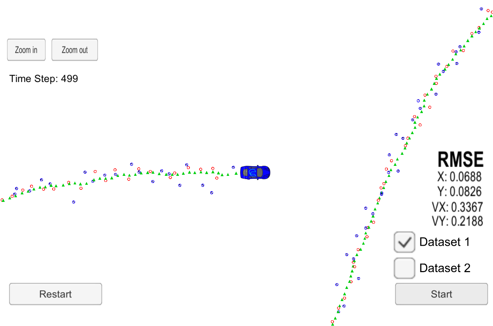
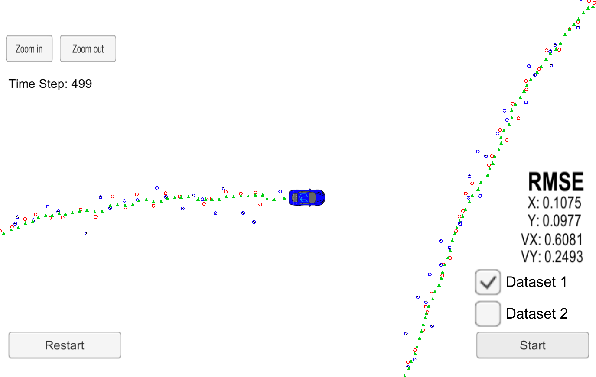
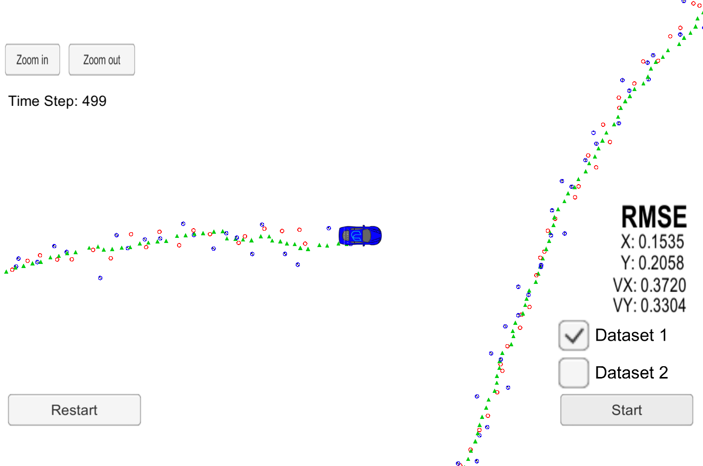

# Unscented Kalman Filter Project 
Self-Driving Car Engineer Nanodegree Program

This Project uses an Unscented Kalman Filter to estimate the state of a moving object of interest with noisy lidar and radar measurements. Passing the project required obtaining RMSE values that are lower that the tolerance outlined in the project reburic.  For this dataset, the target values were px<.09, py<.10, vx<.40, and vy<.30. 

This project involves the Term 2 Simulator which can be downloaded [here](https://github.com/udacity/self-driving-car-sim/releases)

To run the code with the simulator, uWebSocketIO is required.  This repository includes two files that can be used to set up and intall [uWebSocketIO](https://github.com/uWebSockets/uWebSockets) for either Linux or Mac systems. For windows you can use either Docker, VMware, or even [Windows 10 Bash on Ubuntu](https://www.howtogeek.com/249966/how-to-install-and-use-the-linux-bash-shell-on-windows-10/) to install uWebSocketIO. Please see [this concept in the classroom](https://classroom.udacity.com/nanodegrees/nd013/parts/40f38239-66b6-46ec-ae68-03afd8a601c8/modules/0949fca6-b379-42af-a919-ee50aa304e6a/lessons/f758c44c-5e40-4e01-93b5-1a82aa4e044f/concepts/16cf4a78-4fc7-49e1-8621-3450ca938b77) for the required version and installation scripts.

Once the install for uWebSocketIO is complete, the main program can be built and ran by doing the following from the project top directory.

1. mkdir build
2. cd build
3. cmake ..
4. make
5. ./UnscentedKF

Note that the programs that were updated to complete the project are src/ukf.cpp, src/ukf.h, tools.cpp, and tools.h, the other files were provided as starter code by the Udacity Slef-Driving Car Engineering Team.  

The main protcol that main.cpp uses for uWebSocketIO in communicating with the simulator is as follows:

INPUT: values provided by the simulator to the c++ program

["sensor_measurement"] => the measurment that the simulator observed (either lidar or radar)

OUTPUT: values provided by the c++ program to the simulator

["estimate_x"] <= kalman filter estimated position x  
["estimate_y"] <= kalman filter estimated position y  
["rmse_x"]  
["rmse_y"]  
["rmse_vx"]  
["rmse_vy"]  

---

## Other Important Dependencies

* cmake >= v3.5
* make >= v4.1
* gcc/g++ >= v5.4

## Basic Build Instructions

1. Clone this repo.
2. Make a build directory: `mkdir build && cd build`
3. Compile: `cmake .. && make`
4. Run it: `./UnscentedKF path/to/input.txt path/to/output.txt`. You can find
   some sample inputs in 'data/'.
    - eg. `./UnscentedKF ../data/obj_pose-laser-radar-synthetic-input.txt`

## Editor Settings

The Udacity team purposefully kept editor configuration files out of this repo in order to
keep it as simple and environment agnostic as possible. However, they recommend
using the following settings:

* indent using spaces
* set tab width to 2 spaces (keeps the matrices in source code aligned)

these recommendations were followed in the new code.

## Code Style

[Google's C++ style guide](https://google.github.io/styleguide/cppguide.html) was adhered to as much as possible.

---

## Project Rubric

To pass this assignment, the final project must meet certain criteria as defined int he Project Ruberic.  I will go through those items individually, addressing each in turn.

### Code must compile without errors with cmake and make.

The project code does compile with cmake and make, using Docker and the Term 2 Ubuntu 16.04 environment provided by Udacity.

### Your px, py, vx, and vy RMSE should be less than or equal to the values [.09, .10, .40, .30].

The project returns px = 0.0688, py = 0.0826, vx = 0.3367, and vy = 0.2188, meeting this requirement.

### Your Sensor Fusion algorithm follows the general processing flow as taught in the preceding lessons.

The project follows the process laid out in the preceeding lessons, using the code from the exercises as was possible.

### Your Kalman Filter algorithm handles the first measurements appropriately.

The filter initializes with either lidar or radar data, depending on which type in received first.  Both Lidar and Radar data are handled appropriately.

### Your Kalman Filter algorithm first predicts then updates.

As per the process described in the lectures (and the opposite of the intial provided code, which does the opposite), the Kalman filter her predicts first, then updates.

### Your Kalman Filter can handle radar and lidar measurements.

The code is designed to update based on either radar and lidar input, and has been tested with just lidar, just radar, and with both input types.  The combined input type showed the best end results.

## Your algorithm should avoid unnecessary calculations.

The code breaks out angle normalization to a callable method, rather than repeating the same process multiple times and the initial code did.  It also pre-calculates and reuses indepentant values where possible to save time.

---

## Analysis

The Unscented Kalman Filter does an excellent job of prediction position and handling noise, without the need for a Jacobian step like the Extended Kalmann Filter.  After running the completed code with just lidar:

and with just radar:

it is clear that combining both data sets is advantagious.  By using sigma points to project the non-linear results of the Unscented Kalman fiter back to measurement space, we get a very good aproximation of a gaussian result, without being limited to linear functions only.
